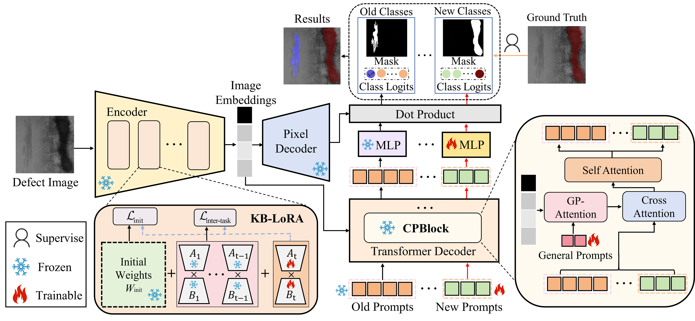

# **KSPNet** （under review）

## Introduction

This repository provides the related code and experimental details for our research on Knowledge-Sharing Prompt Network for Continual Defect Segmentation.



## Implementation

**Environment installation**

```shell
conda create -n kspnet python==3.8
conda activate kspnet
conda install --file requirements.txt
```

Our implementation is based on [mask2former](https://github.com/facebookresearch/Mask2Former), Please check the [installation instructions](https://github.com/facebookresearch/Mask2Former/blob/main/INSTALL.md) 

**Data preparation**

+ We release the **CID-Seg dataset**，Please download form [here](https://github.com/PEfang-CV/KSPNet/blob/main/CID-Seg.zip)
+ The **WD-Seg dataset** is sourced from corporate collaborations. If you want to the data，please send  the email to us. we will send the download link once we receive and confirm your signed agreement.
+ After downloading the dataset, please archive it into the `datasets` folder.

**Quick Start**
1. Step t=0: Training the model for base classes
2. Step t>1: Training the model for novel classes with KSPNet

|      Scenario      |            Script             |
|:------------------:|:-----------------------------:|
| CID-Seg-CDS 11-1 | `sh script/cid_cds/11_1.sh`   |
| CID-Seg-CDS 9-3 | `sh script/cid_cds/9_3.sh`  |
| CID-Seg-CDS 6-6 | `sh script/cid_cds/6_6.sh`  |
| CID-Seg-CDS 6-3 | `sh script/cid_cds/6_3.sh`   |
| CID-Seg-CDS 6-2 | `sh script/cid_cds/6_2.sh`   |
| WD-Seg-CDS 6-1 | `sh script/wd_cds/6_1.sh`   |
| WD-Seg-CDS 4-3 | `sh script/wd_cds/4_3.sh`   |
| WD-Seg-CDS 3-4 | `sh script/wd_cds/3_4.sh`  |
| WD-Seg-CDS 3-2 | `sh script/wd_cds/3_2.sh`              |
| WD-Seg-CDS 4-1 | `sh script/wd_cds/4_1.sh`  |

* or run the script
    ```shell
    sh run.sh
    ```

## Notes

+ If there are any issues with the code, please  send the email  to us.

